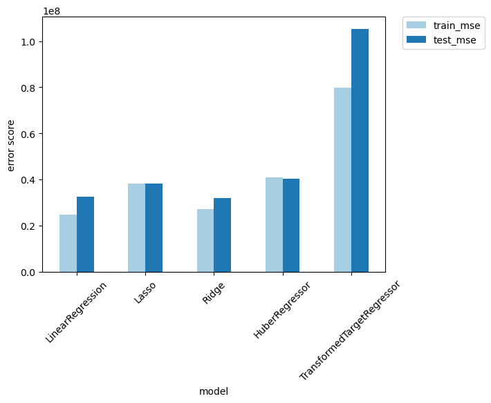

# AI-Coupon-Statistics
## Will a Customer Accept the Coupon?

Goto [prompt_II_2.ipynb](prompt_II_2.ipynb) for complete Jupyter Notebook.
------

**Context**

In this application, you will explore a dataset from kaggle. The original dataset contained information on 3 million used cars. The provided dataset contains information on 426K cars to ensure speed of processing.  Your goal is to understand what factors make a car more or less expensive.  As a result of your analysis, you should provide clear recommendations to your client -- a used car dealership -- as to what consumers value in a used car.

------
### Data analysis:
- Size of the dataset had size column with lot of na values. So, I dropped the size column
- I dropped the columns that had more than 50% of the values as na or 0
- Removed outliers from the dataset
### Data Visualization:
 #### Numerical columns -
 1. mean price of cars with year 2021 is highest and gradually decreases as year decreases
 2. There are lot of cars with age 10 in the dataset, but mean price of cars with age 10 is not the highest. mean price of cars with age 1 is highest, followed by age 2 and 3
 #### 3.5.1 Categorical columns - small
 1. mean price of cars with condition 'new' is highest, followed by 'excellent' and 'good', 'fair' and 'salvage' are lowest
 2. mean price of cars with cylinders 12 is highest, 5 is lowest
 3. mean price of cars with drive '4wd' is highest, followed by 'rwd' and 'fwd'
 4. mean price of cars with fuel 'other' is highest, 'hybrid' is lowest
 5. mean price of cars with title_status 'lien' is highest, 'missing' is lowest
 6. mean price of cars with transmission 'other' is highest, 'manual' is lowest
 #### 3.5.2 Categorical columns - large
 1. mean price of cars with manufacturer 'ferarri' is highest, 10th highest is 'jaguar'. coutplot shows that 'ford' is the most common manufacturer
 2. coutplot shows that 'f-150' is the most common model
 3. mean price of cars with type 'other' is highest, 10th highest is 'wagon'. coutplot shows that 'sedan' is the most common type
 4. Hard to tell anything from the boxplots of paint_color, but from the countplots we can see that 'white' is the most common color
 5. mean price of cars with state 'wv' is highest, 10th highest is 'sc'. coutplot shows that 'ca' is the most common state
 6. coutplot shows that 'vermont' is the most common region

### Recommendations: (Covered in #4 model building)
Created below models:
1. Linear Regression
2. Ridge Regression
3. Lasso Regression
4. HuberRegressor
5. TransformedTargetRegressor

#### Evaluation (Secction #5) Show comparison of all models using MSE in image below:

Conclusion: Based on this plot we can see that Linear Regression and Ridge Regression are the best models for this dataset. We can also see that Lasso Regression and HuberRegressor are not good models for this dataset.

### Next steps:
 - Perform grid search on Linear Regression and Ridge Regression to find the best parameters
 - From Permutation Importance, we can see that the most important features are:
1. model
2. manufacturer
3. age

#### these are the most important features that are driving the price of a car.

------
